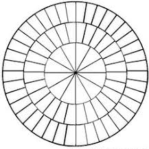

## Round Cake Servings Calculator


The purpose of this application is to calculate how many portions your round cake serves.  
   
To use the calculator you must know:  
   
<div class = "blue">- the HEIGHT and  
- DIAMETER</div>   
   
of your round cake in INCHES.

The calculator is build for the most common dimensions, i.e.   

<div class = "red">- a height of 2, 3 or 4 inches and   
- a diameter of 4 to 16 inches (steps of 2 inches). </div>

---

If your cake height deviates a little - let's say 2.5 inch heigh - you could choose the lower 
standard height of 2 inch. The cake pieces will be little bigger than a normal serving.   
   
Of course if almost everyone who eats this cake wants to be aware of weight-gain, or at a wedding
when everyone already has eaten too much, it is better to choose the 3 inch for calculation. 

For deviation in the diameter you can follow the same rule:  

- For smaller portions:
<div class="red2"> choose the nearest bigger standard diameter </div> 
- For bigger portions:   
<div class="blue"> choose the nearest smaller standard diamater </div>

## Slicing instructions
In the calculator you will allso find some slicing instructions.   

Please read them carefully and bear in mind that you have to slice big cakes
like this example (picture is not interactive).   



##The code
Using a standard size of 8.5 cubic inch for one serving, the code is quite simple. 
Here I show a sample with a cake height of 4 inches and a cake diameter of 10 inches:

```{r}
cakeheight <- 4; cakediameter <- 10
as.integer((cakeheight * (cakediameter/2)^2 * 3.1415)/8.5)
```
The shiny app developed for this assignment is avalilable at: https://marlein.shinyapps.io/roud_cake_portion_calculator/

The source codes of ui.R and server.R and also Rpresentation are available on the GitHub repo: https://github.com/Marlein/CourseraDevelopingDataProducts.

<div class = "green">I hope you enjoyed my silly round cake servings calculator!</div>
